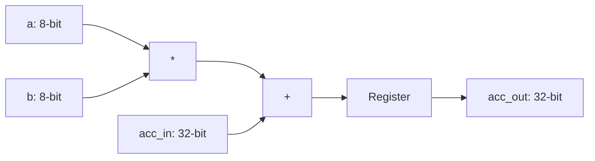

# 8-bit Signed MAC Unit

A high-performance Verilog implementation of a Multiply-Accumulate unit, designed for 4x4 systolic arrays on Xilinx Zynq FPGAs.

## Quick Start
1. **Compile**: `make compile`
2. **Simulate**: `make simulate`

## Architecture
### MAC Unit

### 4x4 Systolic Array
The systolic array tiles 16 MAC units to perform matrix multiplication. It features:
- **Internal Skewing**: Managed input timing to simplify external control.
- **Wavefront Propagation**: Data flows "systolically" across the grid every clock cycle.
- **AXI4-Lite Interface**: Memory-mapped control for easy integration with ARM/Soft processors.
- **DSP Mapping**: Optimized for Xilinx DSP48 slices (16 total).

## Repository Structure
- `top_level.v`: AXI4-Lite wrapper for the systolic array.
- `mac_unit.v`: Core Processing Element (PE).
- `systolic_array_4x4.v`: 4x4 grid with internal propagation and skewing.
- `top_level_tb.v`: AXI-level testbench.
- `mac_unit_tb.v`: Unit testbench for a single PE.
- `systolic_array_4x4_tb.v`: System testbench for 4x4 matrix multiplication.
- `Makefile`: Automation for Vivado 2024.2 CLI flow.
- `docs/`:
    - [Vivado Guide](docs/VIVADO_GUIDE.md): Toolchain setup and debugging.
    - [Architecture & Theory](docs/ARCHITECTURE.md): Mathematical and hardware details.
