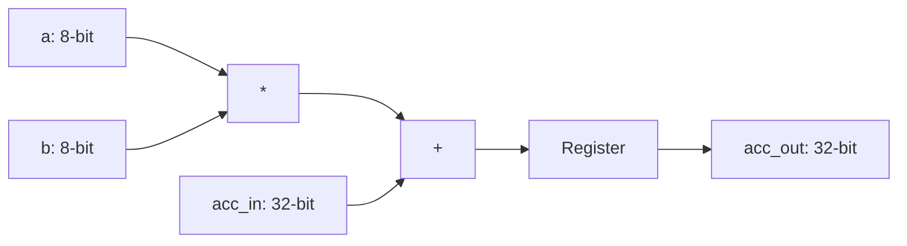

# 8-bit Signed MAC Unit

A high-performance Verilog implementation of a Multiply-Accumulate unit, designed for 4x4 systolic arrays on Xilinx Zynq FPGAs.

## Quick Start
1. **Compile**: `make compile`
2. **Simulate**: `make simulate`

## Architecture

## Repository Structure
- `mac_unit.v`: Core RTL implementation.
- `mac_unit_tb.v`: Self-checking testbench.
- `Makefile`: Automation for Vivado 2024.2 CLI flow.
- `docs/`:
    - [Vivado Guide](docs/VIVADO_GUIDE.md): Toolchain setup and debugging.
    - [Architecture & Theory](docs/ARCHITECTURE.md): Mathematical and hardware details.
