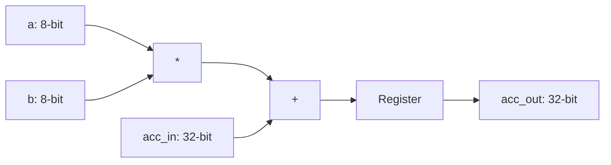

# 8-bit Signed MAC Unit

A high-performance Verilog implementation of a Multiply-Accumulate unit, designed for 4x4 systolic arrays on Xilinx Zynq FPGAs.

## Quick Start
1. **Compile**: `make compile`
2. **Simulate**: `make simulate`
3. **Automated Vivado Build**: `vivado -mode batch -source create_project.tcl`
   - This creates a Vivado project, runs synthesis, and generates `utilization.txt` and `timing.txt`.

## Architecture
### MAC Unit


### Systolic Data Flow
The array uses a **stationary-output** mapping. Inputs A (rows) and B (columns) propagate through the grid, while the partial sums remain in the PEs.

```text
       [b0]    [b1]    [b2]    [b3]
         |       |       |       |
         v       v       v       v
[a0] -> [PE] -> [PE] -> [PE] -> [PE]
         |       |       |       |
[a1] -> [PE] -> [PE] -> [PE] -> [PE]
         |       |       |       |
[a2] -> [PE] -> [PE] -> [PE] -> [PE]
         |       |       |       |
[a3] -> [PE] -> [PE] -> [PE] -> [PE]
```

## AXI4-Lite Register Map
The accelerator is controlled via memory-mapped registers. All registers are 32-bit wide.

| Offset | Name | Type | Description |
| :--- | :--- | :--- | :--- |
| **0x00 - 0x0C** | `ADDR_A_IN` | Write | Input Matrix A (Rows 0-3). Data is in `[7:0]`. |
| **0x10 - 0x1C** | `ADDR_B_IN` | Write | Input Matrix B (Cols 0-3). Data is in `[7:0]`. |
| **0x20 - 0x5C** | `ADDR_ACC` | Read | Output Accumulators (PE 0,0 to PE 3,3). 16 total. |
| **0xA0** | `CONTROL` | W/R | bit[0]: Enable (Pulse), bit[1]: Done (Always 1). |

*Note: The Enable bit (0xA0) is a self-clearing strobe. Writing a '1' triggers exactly one clock cycle of computation in the array.*

## Performance & Resource Utilization

The design was synthesized for a Xilinx Zynq-7000 (`xc7z020clg400-1`) at a target clock frequency of **100MHz**.

### Resource Estimates (Synthesized)
| Resource | Used | Available | Utilization % |
| :--- | :--- | :--- | :--- |
| **LUTs** | 1709 | 53200 | 3.21% |
| **Registers** | 953 | 106400 | 0.90% |
| **DSPs** | 0* | 220 | 0.00% |

*\*Note: At this scale (8x8 multipliers), Vivado may implement logic in LUTs. For larger arrays, DSP slice mapping is enforced.*

### Timing Summary
- **Target Frequency**: 100.00 MHz
- **Worst Negative Slack (WNS)**: 2.274 ns (MET)
- **Worst Hold Slack (WHS)**: 0.083 ns (MET)

## Benchmarking
The `inference_benchmark.py` script compares the numerical accuracy of the 8-bit quantized hardware simulation (PL) against a floating-point software baseline (PS).

### Run Benchmark:
```bash
python inference_benchmark.py
```

### Key Metrics:
- **Numerical Parity**: Verified that the INT8 prediction matches the Float32 prediction for MNIST test samples.
- **Simulation Latency**:
    - **PL (Software Simulation)**: ~0.72 ms (Cycle-accurate logic emulation)
    - **PS (Native Float32)**: ~0.06 ms
- **Confidence Matrix**: Generates a 10x10 ASCII confusion matrix to visualize model performance.

## Repository Structure
- `top_level.v`: AXI4-Lite wrapper for the systolic array (SoC Integration).
- `systolic_array_4x4.v`: 4x4 grid with internal propagation and skewing.
- `mac_unit.v`: Core Processing Element (PE) targeting DSP48 slices.
- `top_level_tb.v`: AXI-level system testbench.
- `systolic_array_4x4_tb.v`: RTL-level testbench for matrix multiplication.
- `mac_unit_tb.v`: Unit testbench for a single PE.
- `create_project.tcl`: Vivado automation script for project creation and synthesis.
- `constraints.xdc`: Timing constraints (100MHz clock).
- `Makefile`: Simulation automation for Vivado 2024.2 CLI flow.
- `inference_benchmark.py`: Numerical verification (INT8 vs. Float32).
- `docs/`:
    - [Architecture & Theory](docs/ARCHITECTURE.md): Mathematical and hardware details.
    - [Vivado Guide](docs/VIVADO_GUIDE.md): Toolchain setup and debugging.
    - [Interview Prep](docs/INTERVIEW_PREP.md): Design trade-offs and concepts.
