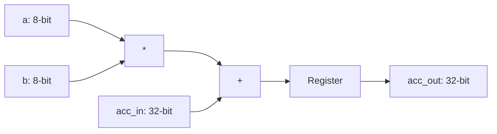

# 8-bit Signed MAC Unit

A high-performance Verilog implementation of a Multiply-Accumulate unit, designed for 4x4 systolic arrays on Xilinx Zynq FPGAs.

## Quick Start
1. **Compile**: `make compile`
2. **Simulate**: `make simulate`
3. **Automated Vivado Build**: `vivado -mode batch -source create_project.tcl`
   - This creates a Vivado project, runs synthesis, and generates `utilization.txt` and `timing.txt`.

## Architecture
### MAC Unit

### 4x4 Systolic Array
The systolic array tiles 16 MAC units to perform matrix multiplication. It features:
- **Internal Skewing**: Managed input timing to simplify external control.
- **Wavefront Propagation**: Data flows "systolically" across the grid every clock cycle.
- **AXI4-Lite Interface**: Memory-mapped control for easy integration with ARM/Soft processors.
- **DSP Mapping**: Optimized for Xilinx DSP48 slices (16 total).

## AXI4-Lite Register Map
The accelerator is controlled via memory-mapped registers. All registers are 32-bit wide.

| Offset | Name | Type | Description |
| :--- | :--- | :--- | :--- |
| **0x00 - 0x0C** | `ADDR_A_IN` | Write | Input Matrix A (Rows 0-3). Data is in `[7:0]`. |
| **0x10 - 0x1C** | `ADDR_B_IN` | Write | Input Matrix B (Cols 0-3). Data is in `[7:0]`. |
| **0x20 - 0x5C** | `ADDR_ACC` | Read | Output Accumulators (PE 0,0 to PE 3,3). 16 total. |
| **0xA0** | `CONTROL` | W/R | bit[0]: Enable (Pulse), bit[1]: Done (Always 1). |

*Note: The Enable bit (0xA0) is a self-clearing strobe. Writing a '1' triggers exactly one clock cycle of computation in the array.*

## Repository Structure
- `top_level.v`: AXI4-Lite wrapper for the systolic array.
- `mac_unit.v`: Core Processing Element (PE).
- `systolic_array_4x4.v`: 4x4 grid with internal propagation and skewing.
- `top_level_tb.v`: AXI-level testbench.
- `mac_unit_tb.v`: Unit testbench for a single PE.
- `systolic_array_4x4_tb.v`: System testbench for 4x4 matrix multiplication.
- `create_project.tcl`: Vivado automation script.
- `constraints.xdc`: Timing constraints (100MHz clock).
- `Makefile`: Simulation automation for Vivado 2024.2 CLI flow.
- `docs/`:
    - [Vivado Guide](docs/VIVADO_GUIDE.md): Toolchain setup and debugging.
    - [Architecture & Theory](docs/ARCHITECTURE.md): Mathematical and hardware details.
    - [Interview Prep](docs/INTERVIEW_PREP.md): Design trade-offs and concepts.
