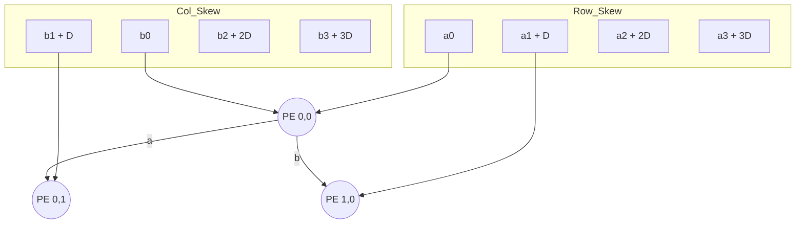

# MAC Unit Architecture

## Mathematical Theory
The Multiply-Accumulate (MAC) unit performs:
$$acc_{out} = acc_{in} + (a \times b)$$

## Implementation Details
- **Signed Arithmetic**: Uses the `signed` keyword for all ports. **Warning**: Missing `signed` results in incorrect unsigned math.
- **Pipelining**: `acc_out` is registered on the rising edge of `clk`.
- **Reset**: Synchronous active-low reset (`rst_n`).

## Systolic Array 4x4
The `systolic_array_4x4` module tiles 16 MAC units in a 4x4 grid.

### Space-Time Mapping
To perform matrix multiplication $C = A \times B$, the array uses **stationary-output** mapping:
1. **Internal Skewing**: Inputs are delayed by $i$ cycles for row $i$ and $j$ cycles for column $j$ to ensure operands meet at the correct PE at the correct time.
2. **Data Propagation**: Values of $A$ move horizontally and $B$ move vertically through the grid, registered at each hop.
3. **Local Accumulation**: Each PE accumulates its partial product locally by feeding `acc_out` back to `acc_in`.

### Grid Topology

## AXI4-Lite Integration
The `top_level` module wraps the systolic array in an AXI4-Lite slave interface, enabling memory-mapped access to inputs, control registers, and results.

### Register Map
| Offset | Name      | Type | Description                       |
|--------|-----------|------|-----------------------------------|
| 0x00   | A_IN[0]   | RW   | Row 0 input (bottom 8 bits)       |
| 0x04   | A_IN[1]   | RW   | Row 1 input (bottom 8 bits)       |
| 0x08   | A_IN[2]   | RW   | Row 2 input (bottom 8 bits)       |
| 0x0C   | A_IN[3]   | RW   | Row 3 input (bottom 8 bits)       |
| 0x10   | B_IN[0]   | RW   | Col 0 input (bottom 8 bits)       |
| 0x14   | B_IN[1]   | RW   | Col 1 input (bottom 8 bits)       |
| 0x18   | B_IN[2]   | RW   | Col 2 input (bottom 8 bits)       |
| 0x1C   | B_IN[3]   | RW   | Col 3 input (bottom 8 bits)       |
| 0x20-5C| ACC[0-15] | RO   | 32-bit PE results (16 registers)  |
| 0xA0   | CONTROL   | RW   | Bit 0: Enable (Self-clearing), Bit 1: Done (RO) |

### Control Logic
The `CONTROL` register at `0xA0` features a self-clearing `Enable` bit. When a `1` is written to bit 0, the internal `control_reg_en` signal pulses high for exactly one clock cycle. This triggers the systolic array to:
1. Shift new row/column inputs into the edge PEs.
2. Propagate internal data through the pipeline registers.
3. Perform one Multiply-Accumulate operation in every PE.

This design eliminates the need for software to manually clear the bit, ensuring precise control over the systolic cycles.

### SoC Integration
In a typical Zynq SoC system, this module is instantiated as a "Custom IP":
1. **Connectivity**: The `top_level` connects to the PS (Processing System) via the **M_AXI_GP0** port.
2. **Addressing**: The module is mapped into the PS memory space (e.g., starting at `0x43C0_0000`).
3. **Interrupts**: While not implemented here, a common extension is to add an interrupt line that triggers when the "Done" bit is set.
4. **DMA**: For larger matrices, AXI4-Lite is replaced by AXI-Stream and a DMA engine to feed data at full clock speed.

## Resource Utilization
This design is optimized for Xilinx Zynq FPGAs. Each `mac_unit` infers a single **DSP48** slice, totaling 16 DSPs for the 4x4 array.
