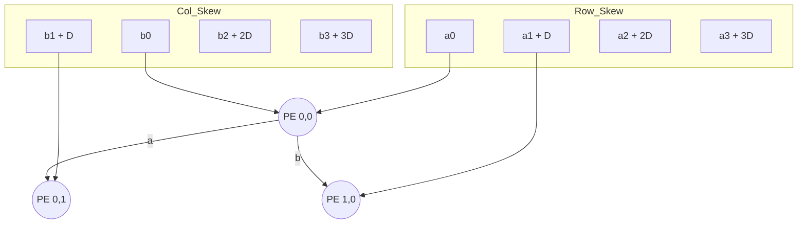

# MAC Unit Architecture

## Mathematical Theory
The Multiply-Accumulate (MAC) unit performs:
$$acc_{out} = acc_{in} + (a \times b)$$

## Implementation Details
- **Signed Arithmetic**: Uses the `signed` keyword for all ports. **Warning**: Missing `signed` results in incorrect unsigned math.
- **Pipelining**: `acc_out` is registered on the rising edge of `clk`.
- **Reset**: Synchronous active-low reset (`rst_n`).

## Systolic Array 4x4
The `systolic_array_4x4` module tiles 16 MAC units in a 4x4 grid.

### Space-Time Mapping
To perform matrix multiplication $C = A \times B$, the array uses **stationary-output** mapping:
1. **Internal Skewing**: Inputs are delayed by $i$ cycles for row $i$ and $j$ cycles for column $j$ to ensure operands meet at the correct PE at the correct time.
2. **Data Propagation**: Values of $A$ move horizontally and $B$ move vertically through the grid, registered at each hop.
3. **Local Accumulation**: Each PE accumulates its partial product locally by feeding `acc_out` back to `acc_in`.

### Grid Topology

## Resource Utilization
This design is optimized for Xilinx Zynq FPGAs. Each `mac_unit` infers a single **DSP48** slice, totaling 16 DSPs for the 4x4 array.
