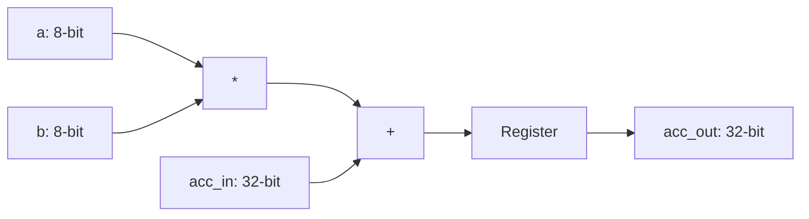

# MAC Unit Documentation Implementation Plan

> **For agentic workers:** REQUIRED: Use superpowers:subagent-driven-development (if subagents available) or superpowers:executing-plans to implement this plan. Steps use checkbox (`- [ ]`) syntax for tracking.

**Goal:** Create a professional, GitHub-ready documentation suite for the 8-bit signed MAC unit.

**Architecture:** A three-file modular structure consisting of a project README, a technical Vivado toolchain guide, and a deep-dive architectural specification.

**Tech Stack:** Markdown, Mermaid.js (for diagrams), Vivado 2024.2 CLI (`xvlog`, `xelab`, `xsim`).

---

## Chunk 1: Directory Setup & VIVADO_GUIDE.md

### Task 1: Setup docs directory and create VIVADO_GUIDE.md

**Files:**
- Create: `docs/VIVADO_GUIDE.md`

- [ ] **Step 1: Create the docs directory**

Run: `mkdir -p docs`

- [ ] **Step 2: Write VIVADO_GUIDE.md**
Include details on `xvlog`, `xelab`, `xsim`, `Makefile` usage, and `wave.tcl` for waveforms.

```markdown
# Vivado Toolchain Guide

This guide details how to compile, simulate, and debug the MAC unit using Xilinx Vivado 2024.2.

## Environment Setup
The tools are located at `/home/aleem/Vivado/2024.2/bin`. Ensure this path is in your `PATH` or use the provided Makefile.

## Compilation Flow
1. **Parsing (`xvlog`)**: Parses Verilog/SystemVerilog sources.
2. **Elaboration (`xelab`)**: Generates a simulation snapshot.
3. **Simulation (`xsim`)**: Runs the snapshot.

## Command Reference
- Compile: `make compile` (runs `xvlog --sv`)
- Simulate: `make simulate` (runs `xelab` and `xsim`)
- Clean: `make clean`

## Waveform Debugging
To view waveforms:
1. Run `make simulate`.
2. Open the resulting `.wdb` file in Vivado GUI or use the `-tclbatch wave.tcl` flag with `xsim`.
```

- [ ] **Step 3: Verify links and paths**
Ensure the Vivado path matches the system (`/home/aleem/Vivado/2024.2`).

- [ ] **Step 4: Commit**

```bash
git add docs/VIVADO_GUIDE.md
git commit -m "docs: add comprehensive Vivado toolchain guide"
```

## Chunk 2: ARCHITECTURE.md (The "Everything" Doc)

### Task 2: Create ARCHITECTURE.md

**Files:**
- Create: `docs/ARCHITECTURE.md`

- [ ] **Step 1: Write ARCHITECTURE.md**
Focus on signed math, `signed` keyword importance, registered outputs, and DSP48 mapping.

```markdown
# MAC Unit Architecture

## Mathematical Theory
The Multiply-Accumulate (MAC) unit performs:
$$acc_{out} = acc_{in} + (a \times b)$$

## Implementation Details
- **Signed Arithmetic**: Uses the `signed` keyword for all ports. **Warning**: Missing `signed` results in incorrect unsigned math.
- **Pipelining**: `acc_out` is registered on the rising edge of `clk`.
- **Reset**: Synchronous active-low reset (`rst_n`).

## Resource Utilization
This design is optimized for Xilinx Zynq FPGAs and infers a single **DSP48** slice.
```

- [ ] **Step 2: Review for technical accuracy**
Verify the math formula and the signed arithmetic warning.

- [ ] **Step 3: Commit**

```bash
git add docs/ARCHITECTURE.md
git commit -m "docs: add detailed architecture and theory specification"
```

## Chunk 3: README.md & Final Polish

### Task 3: Create GitHub-ready README.md

**Files:**
- Create: `README.md` (overwrite existing if any)

- [ ] **Step 1: Write README.md**
Include the Mermaid diagram and quick-start links.

```markdown
# 8-bit Signed MAC Unit

A high-performance Verilog implementation of a Multiply-Accumulate unit, designed for 4x4 systolic arrays on Xilinx Zynq FPGAs.

## Quick Start
1. **Compile**: `make compile`
2. **Simulate**: `make simulate`

## Architecture


## Documentation
- [Vivado Guide](docs/VIVADO_GUIDE.md)
- [Architecture & Theory](docs/ARCHITECTURE.md)
```

- [ ] **Step 2: Verify all markdown links**
Click through (or grep) to ensure `docs/VIVADO_GUIDE.md` and `docs/ARCHITECTURE.md` are correctly linked.

- [ ] **Step 3: Commit**

```bash
git add README.md
git commit -m "docs: add GitHub-ready README with architecture diagram"
```
